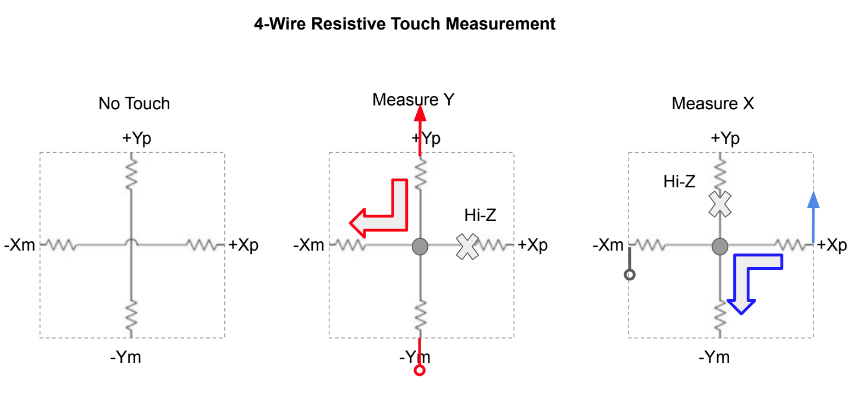

# ESP32_TFTeSPI8bit 
ESP32 w/ 8bit-parallel interface test code, small modification from Bodmer's TFT_eSPI library examples!

 &nbsp;&nbsp;&nbsp;

  
#### Add 4-wire touch
 
 

### References
  - [2.4" TFT LCD Shield](http://www.lcdwiki.com/2.4inch_Arduino_Display) Arduino LCD Shield
  - [TFT_eSPI](https://github.com/Bodmer/TFT_eSPI) Arduino TFT SPI library (w/ 8bit-parallel supports)  
  - [TJpeg Decoder](https://github.com/Bodmer/TJpg_Decoder) A generic JPEG image decompressor module that highly optimized for small embedded systems.
  - [Resistive Touchscreen Principles](https://riverdi.com/resistive-touch-panel-construction-and-working-principles/)
